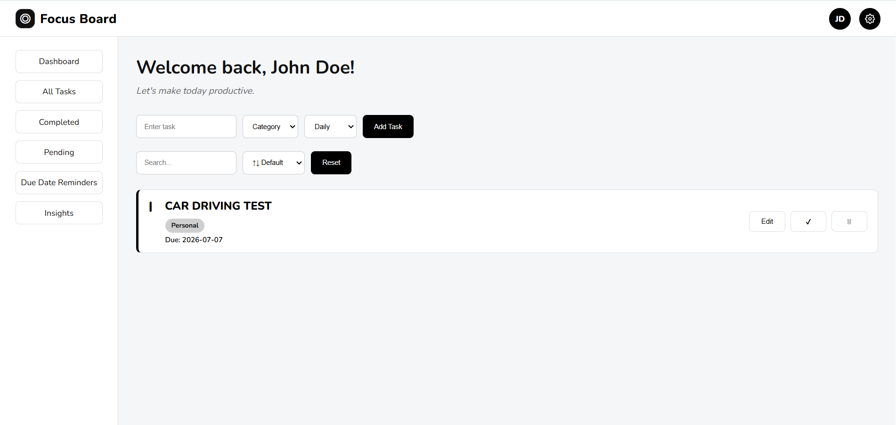
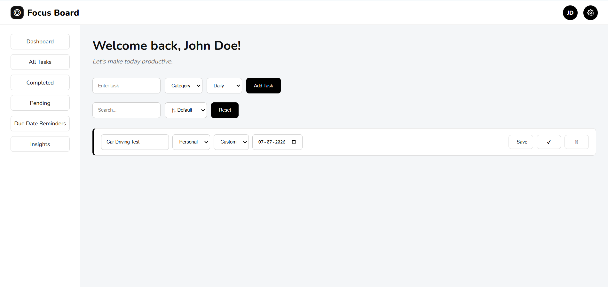
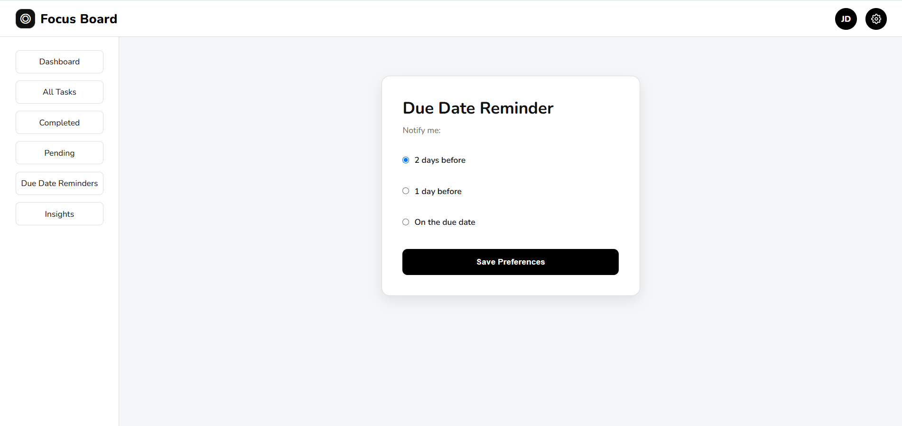
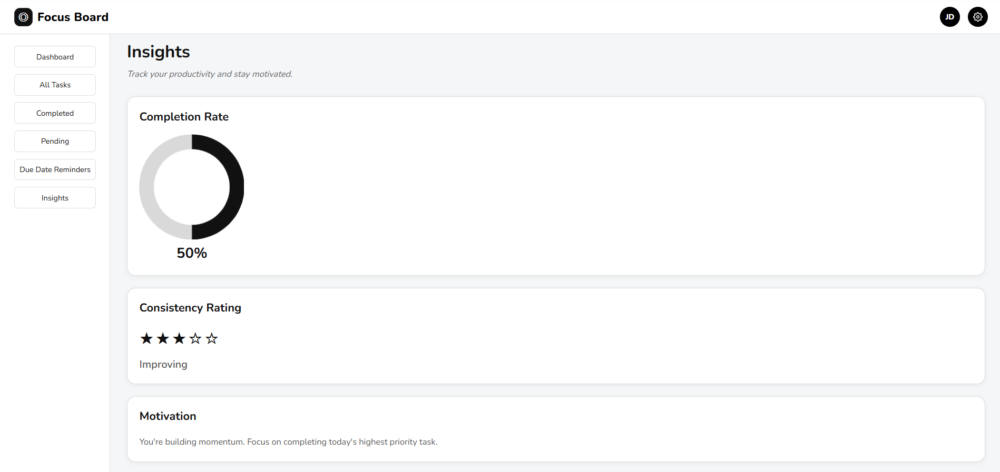
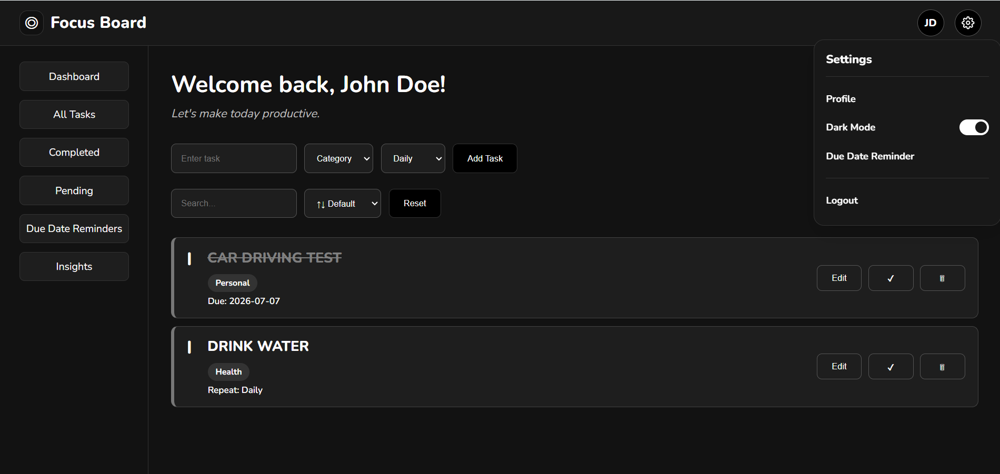
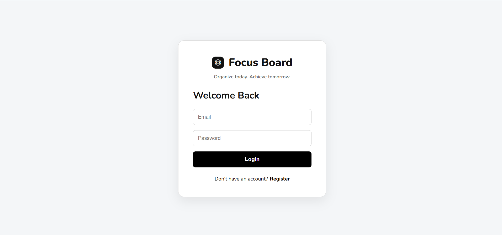

# 📌 Focus Board

### *Productivity isn't just about finishing tasks—it's about building consistency.*

Focus Board is a full-stack productivity application built to make task management more meaningful than simply checking items off a list.

While traditional task managers focus on creating and organizing tasks, Focus Board also helps users understand **how consistently they're accomplishing their goals**. It combines task management with lightweight productivity insights that visualize progress, measure consistency, and provide motivational feedback based on real completion patterns.

Rather than being just another CRUD application, the project explores how small productivity habits can be tracked, measured, and encouraged through thoughtful user experience.

---

## ✨ Features

### 🔐 Authentication

- Secure user registration and login
- JWT-based authentication
- Protected routes
- User profile management

---

### ✅ Task Management

- Create, edit and delete tasks
- Organize tasks with categories
- Set due dates
- Configure repeat schedules
  - Daily
  - Weekly
  - Monthly
  - Custom
- Search tasks
- Sort tasks
- Mark tasks as completed
- Drag-and-drop task reordering

---

### 📂 Organized Task Views

Separate pages make it easier to focus on what matters.

- All Tasks
- Pending Tasks
- Completed Tasks
- Upcoming Due Date Reminders

---

### 📊 Productivity Insights

Focus Board transforms completed work into meaningful feedback.

The Insights dashboard includes:

- Completion Rate visualization using a Doughnut Chart
- Consistency Rating based on completed tasks
- Personalized motivational messages generated from productivity patterns

Instead of displaying raw statistics, the application interprets user activity into simple insights that encourage consistent progress.

---

### ⏰ Reminder Preferences

Users can customize reminder timing before task deadlines.

Available options include:

- 2 days before
- 1 day before
- On the due date

---

### 🎨 User Experience

- Dark Mode
- Responsive Design
- Toast Notifications
- Clean card-based interface
- Simple and distraction-free layout

---

# 🛠 Tech Stack

### Frontend

- React.js
- React Router
- CSS3
- Chart.js
- React ChartJS 2
- DnD Kit

### Backend

- Node.js
- Express.js

### Database

- MongoDB
- Mongoose

### Authentication

- JSON Web Token (JWT)

---

# 📁 Project Structure

```text
FocusBoard/

├── assets/
├── backend/
├── frontend/
└── README.md
```

---

# 💡 What Makes Focus Board Different?

Most task management applications stop after helping users create and complete tasks.

Focus Board goes one step further by asking a different question:

> **"What do your completed tasks say about your productivity?"**

Instead of treating completed work as the end of the workflow, the application uses it to measure consistency, visualize progress, and encourage better habits through personalized feedback.

The goal isn't simply to manage tasks—it's to help users become more consistent over time.

---

# 🚀 Future Improvements

- Email reminders
- Calendar integration
- Productivity streak tracking
- Weekly and monthly analytics
- Team collaboration
- Mobile application
- Progressive Web App (PWA)

---

# 📸 Screenshots

### Dashboard



---

### Edit Task



---

### Due Date Reminder



---

### Insights



---

### Dark Mode



---

### Login



---

# 🎥 Project Demo

Watch the complete walkthrough here:

🔗 **Demo Video:**  
https://drive.google.com/file/d/1ZXv1Ulu4TNipNlRb0rF5R8O6AYeEhW7h/view?usp=sharing

---

# 👩‍💻 Developed By

**Mary Sophia R**

Aspiring Software Engineer | AI & ML Engineering Student

---

*"Small tasks completed consistently create meaningful progress."*
